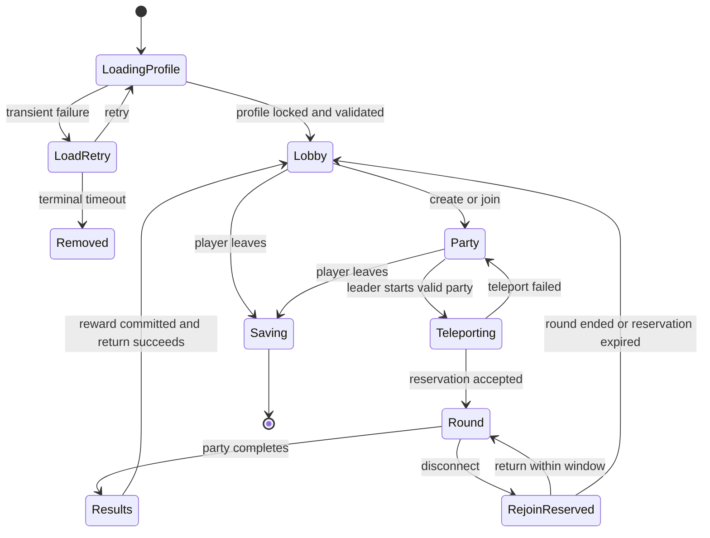
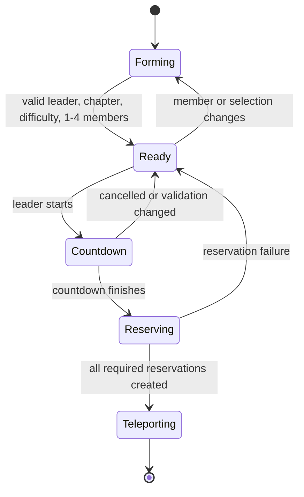
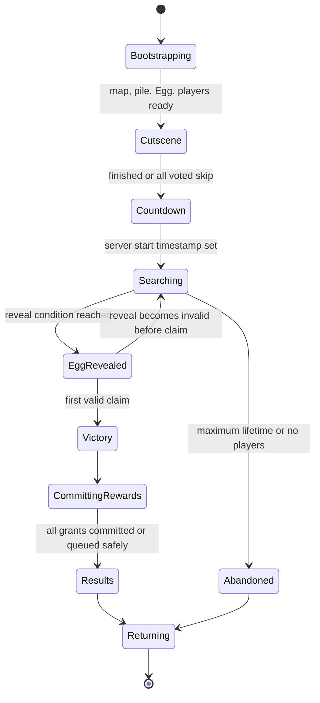
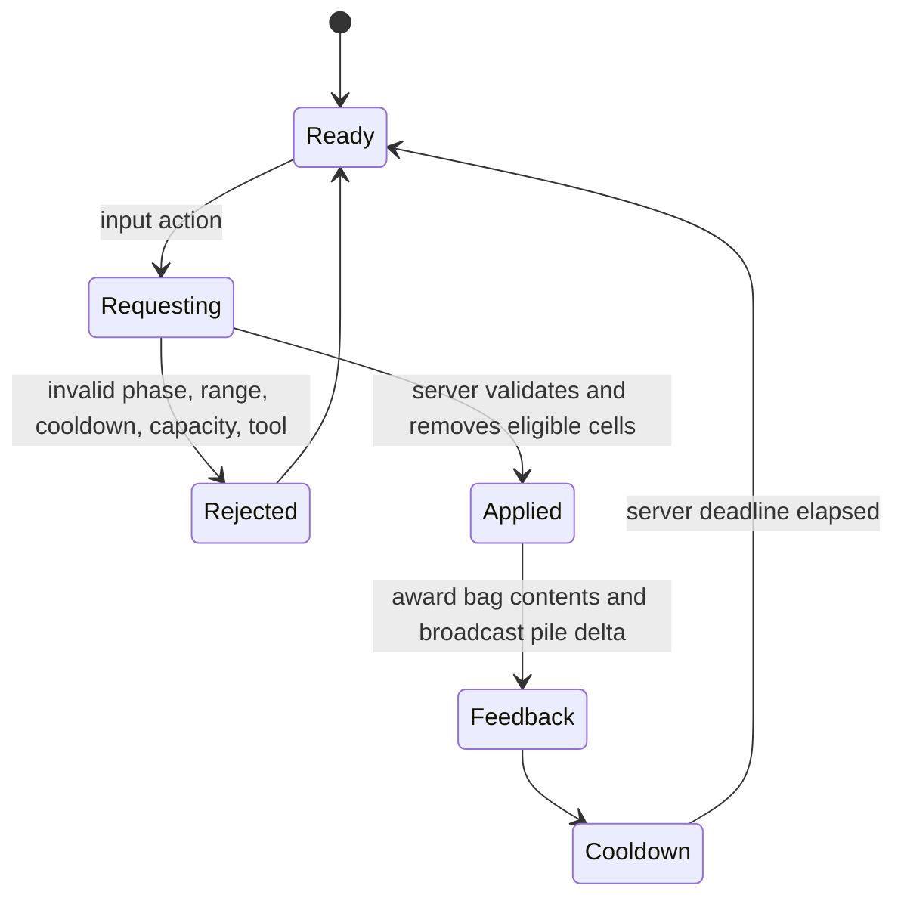
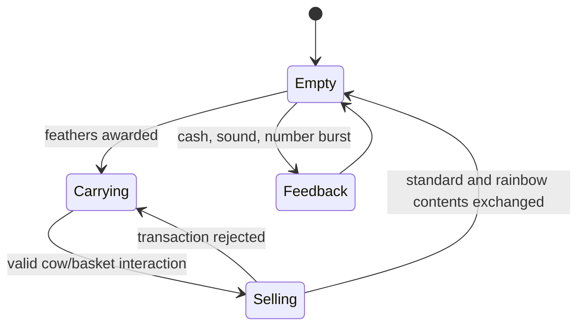
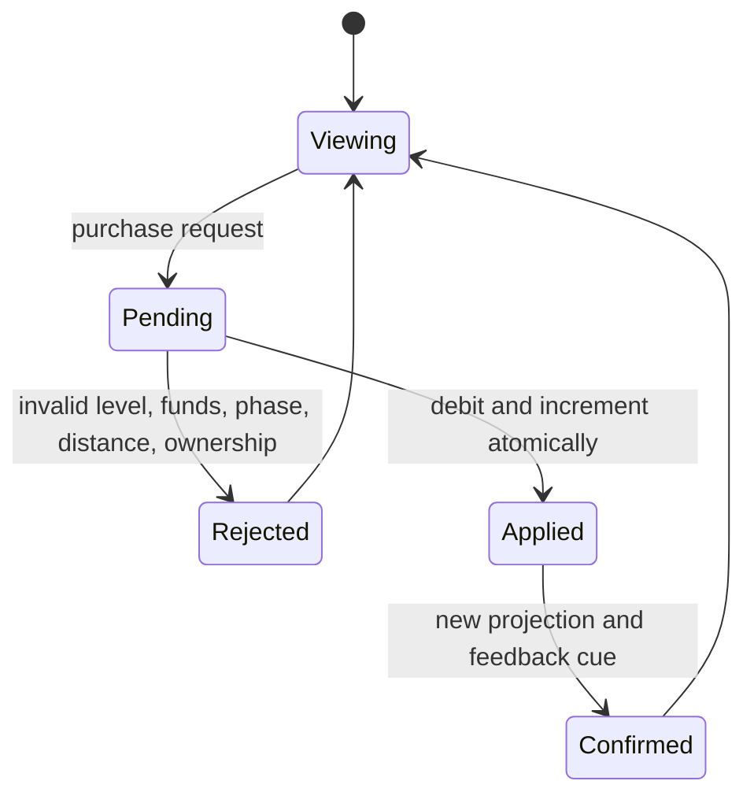
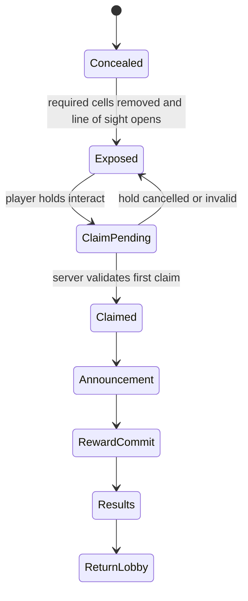
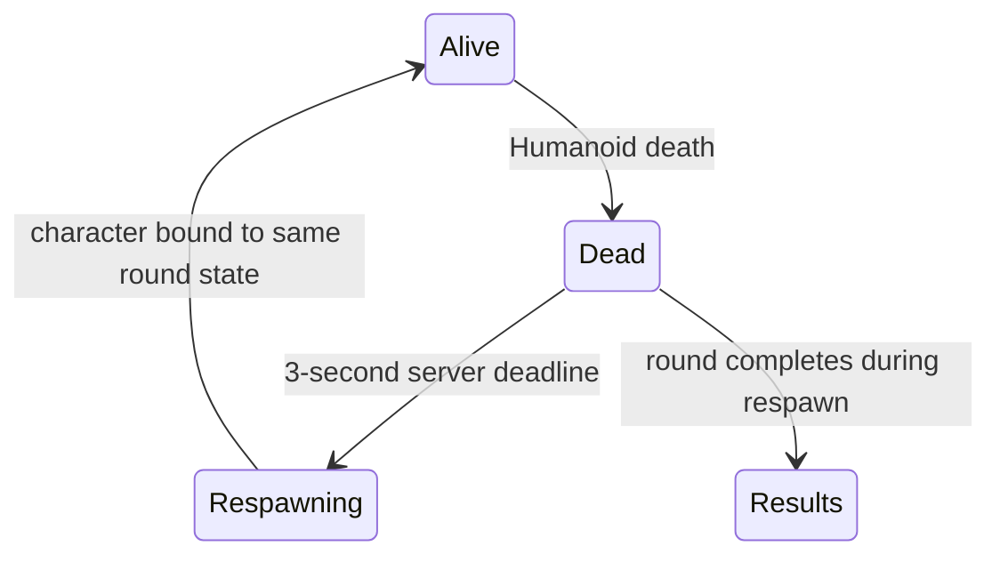
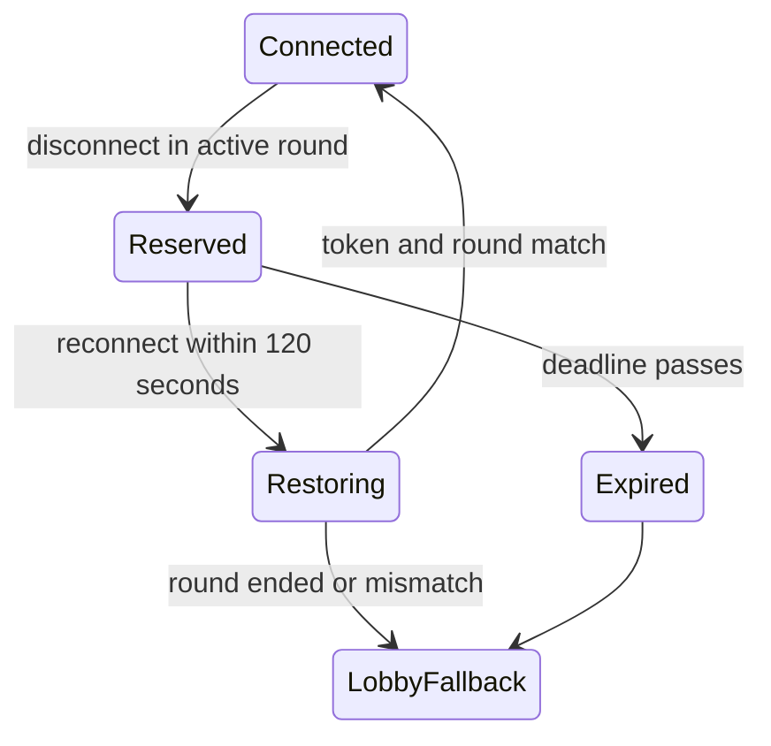

# Search for the Egg - State Machines

All authoritative state transitions run on the server. Clients receive sanitized snapshots and event cues. A client may animate anticipation immediately, but the rewarding impact occurs only after a server acknowledgement.

## 1. Global player lifecycle



Invariant: no player can be active in two authoritative sessions. The profile lock and round membership token must agree before an economy mutation is accepted.

## 2. Lobby and party

### Lobby state

`Loading -> Interactive -> ModalOpen -> Interactive -> JoiningParty -> Party`

- `Loading`: profile projection, entitlements, current configuration, daily eligibility, and live event data are loading.
- `Interactive`: movement and one primary UI modal are permitted.
- `ModalOpen`: modal manager owns input focus. Opening another modal closes or stacks only according to the explicit modal policy.
- `JoiningParty`: disable duplicate requests and show an interruptible progress affordance.

### Party machine



Party invariants:

- Maximum four members; verified from the reference lobby.
- Leader controls chapter/difficulty and start.
- Server recomputes unlock eligibility for every member. Default policy requires every member to own the unlock.
- A member cannot join two parties, and a party cannot start twice.
- Countdown uses a server deadline, not decrement messages.
- If the leader leaves, leadership transfers deterministically to the earliest remaining member.

## 3. Round lifecycle



Round invariants:

- `roundId`, chapter, difficulty, configuration version, and selected Egg node are immutable.
- Timer is `serverNowMs - searchingStartedAtMs`; clients display but do not author it.
- Only `Searching` accepts collection, selling, and upgrades.
- Only `EggRevealed` accepts Egg claim.
- `Victory` is entered once through an atomic compare-and-set equivalent.
- Joining is disabled when `EggRevealed` begins.
- Results do not display a reward as owned until the server transaction is committed or durably queued.

## 4. Feather collection and pile depletion



Server validation order:

1. Player/session token and `Searching` phase.
2. Alive/active player state.
3. Tool ownership and selected action.
4. Rate limit and per-tool cooldown deadline.
5. Character origin and target direction plausibility.
6. Distance/line-of-sight as appropriate.
7. Bag capacity or world-pickup policy.
8. Candidate server grid cells not already depleted.
9. Class/perk/tool modifiers using server-owned state.
10. Atomic cell removal, award calculation, analytics sample, response.

Clients render pooled feather strands and impact VFX from authoritative cell deltas. They never tell the server how many feathers were hit.

## 5. Selling



Sell calculation:

```text
baseCents = standardCount * standardCents
rainbowCents = rainbowCount * standardCents * rainbowMultiplier
classAdjusted = round((baseCents + rainbowCents) * classSellMultiplier)
perkAdjusted = round(classAdjusted * permanentFeatherValueMultiplier)
finalCents = max(0, perkAdjusted)
```

The server clears the exact bag counts and increments cash in one transaction. A duplicated request returns the same transaction result or “nothing to sell,” never a second payment.

## 6. Upgrade purchase



Rules:

- UI previews are calculated from configuration but server recalculates the purchase.
- Request includes upgrade ID and expected current level, not a price.
- Server rejects stale expected levels and returns the latest projection.
- Class discounts are applied once and rounded in cents.
- A maxed path has no purchase action.
- Permanent-tool “max upgrades” are derived from entitlement state and are not written as paid round purchases.

## 7. Egg reveal, discovery, and victory



Polished flow:

1. Final covering feathers lift and spiral rather than simply vanish.
2. The Egg emits a short directional glint and a positional chime.
3. Valid claim locks only gameplay input; camera eases to a framed Egg close-up.
4. Server broadcasts finder display name, chapter, difficulty, and authoritative time.
5. World color grade warms, flock/feather burst triggers within quality budget, and music resolves into a short victory stem.
6. Reward rows count up from zero to committed values. Party reward and finder bonus are visually separate.
7. Results show time, personal best, contribution, rewards, unlocked content, Replay, and Lobby.
8. On auto-continue or Lobby, save is confirmed/queued and the party returns.

The entire sequence is configurable and `ASSUMED` because completion was not present in the source recording.

## 8. Death and respawn



Current `ASSUMED` rule: preserve bag, cash, tools, and upgrades. Disable collection during death. Restore the round HUD after character binding. Never recreate the RoundPlayerState from client UI values.

## 9. Rejoining



The rejoin ticket contains only opaque identifiers in teleport data. The destination server resolves authoritative state. If the original server is gone, persistent rewards survive but round-scoped state does not.

## 10. Tool state machines

### Nest Rake

`Ready -> Windup -> ServerImpact -> Recovery -> Ready`

- Hold upgrade loops from Recovery to Windup while input remains active.
- Impact is authoritative; animation markers request the action but do not grant yield.

### Confetti Charge

`Equipped -> Lighting -> Armed -> Thrown -> Fusing -> Exploded -> Cooldown -> Equipped`

- Server creates the charge identity, clamps throw impulse, owns fuse deadline, selects affected cells, and rolls rainbow/mini-charge effects.
- Client owns trail, fuse sparks, camera impulse, and cosmetic debris within budget.

### Feather Vac

`Idle -> SpinningUp -> Suction -> Overheated -> Cooling -> Idle`

- Heat is server-simulated from elapsed suction time; client meter interpolates.
- Releasing before overheat enters a short spin-down and passive recovery.
- No collection request is accepted while overheated.

### Scout Chick

`Docked -> ToPile -> Collecting -> ToSeller -> Depositing -> ToPile`

- Server selects reachable collection cells and awards the owner only.
- Client animates a smoothed companion path but cannot choose yield.
- On owner death it continues; on owner disconnect it pauses in the reserved state and despawns after expiry.

## 11. Chapter 2 shared puzzle machine

`FindKey -> ActivateLevers -> SolveCrystals -> SolveCode -> SolveTiles -> ReleaseHatchling -> Exit -> Victory`

All puzzle states are shared by the party and replicated as enumerated progress. Exact ordering may be data-driven. Wrong answers provide local feedback and never corrupt the valid solution. Puzzle solutions are generated server-side from a validated solution set and stored in the round state.

## 12. Monetization and receipts

### Game pass

`Unknown -> Checking -> Owned | NotOwned -> Refreshing`

The client may prompt a pass only after the server provides the product mapping. After purchase completion, the server rechecks ownership before granting.

### Developer product

`Prompted -> RobloxPurchase -> ReceiptReceived -> Validating -> Granting -> Persisted -> Acknowledged`

Only `Persisted` returns `PurchaseGranted`. Replayed receipts return the prior committed result. UI confirmation follows server projection, not `PromptProductPurchaseFinished` alone.

## 13. UI modal ownership

At most one blocking modal owns focus. Non-blocking HUD panels may coexist according to safe-area rules.

Priority from highest to lowest:

1. Platform purchase prompt
2. Load/save failure or reconnect state
3. Victory/results
4. Party/teleport state
5. Shop/classes/daily/codes/inventory/stats
6. Tutorial coach marks
7. Toasts and ambient prompts

Opening a higher-priority modal suspends lower-priority input and restores prior focus on close. Controller selection must never fall to `nil` while a visible actionable modal is open.
